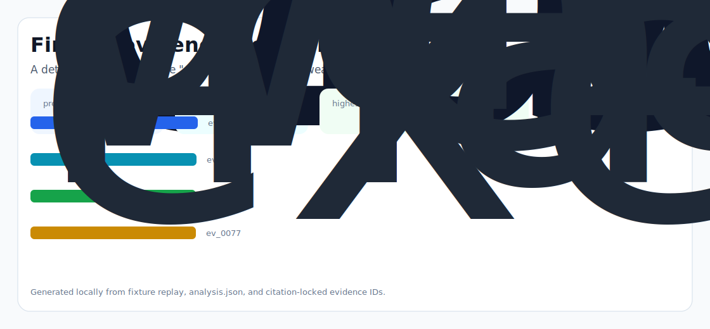

# Finn Ledger

A deterministic, replayable "decision ledger" for AI wealth managers: every trade Finn proposes is a typed, simulated, wash sale safe MoveProposal with a tax impact diff and a counterfactual the user can accept, reject or amend in one tap.



## Why it exists

Finn is sold as an autopilot wealth manager that "executes money moves" and "optimizes tax." For a chatbot, that is enormously legally and operationally loaded. Three concrete things any due diligence grade user (or, more importantly, an OCC/SEC examiner or a fee paying customer's CFP) will ask the next time Finn proposes a trade are: (1) Did Finn.

The project is intentionally built as a local replay harness instead of a slide. It creates fixtures, plants realistic failure modes, produces citation-locked evidence, and turns the result into a dashboard a reviewer can inspect without credentials or hosted services.

## What is inside

- Deterministic fixture generation for the company-specific risk surface.
- Strategy code in `src/finn_ledger/strategy.py` with project-specific scoring and visual evidence.
- Citation-locked reports where every decision claim points to a generated evidence ID.
- Two regenerated visual artifacts: `outputs/project_working.svg` and `outputs/evidence_map.svg`.
- A portable demo pack with JSON, CSV, Markdown, HTML, SVG, benchmark, and test artifacts.


## Signals it measures

- `autopilot coverage`
- `wealth risk`
- `manager precision`
- `executes latency`

## Failure modes it plants

- autopilot drift
- wealth gap
- manager misroute
- executes blindspot

## Run it locally

```bash
uv sync
uv run finn-ledger all
uv run pytest -q
uv run ruff check .
```

## Outputs worth opening

- `outputs/dashboard.html`
- `outputs/project_working.svg`
- `outputs/evidence_map.svg`
- `outputs/operator_brief.md`
- `outputs/decision_report.md`
- `outputs/strategy_model.json`
- `outputs/demo_pack.zip`

## Sources

- https://www.ycombinator.com/companies/finvest
- https://www.usenix.org/conference/srecon22apac/speaker-or-organizer/shivam-bharuka-meta
- https://github.com/Shivam2501
- https://nocap.blog/founder/shivam-bharuka/
- https://www.usenix.org/conference/srecon22apac/presentation/bharuka
- https://alpaca.markets/docs/api-references/trading-api/
- https://www.irs.gov/publications/p550

## Boundary

Everything runs locally against synthetic fixtures. There are no credentials, no customer records, no outreach files, and no hosted API dependency.
